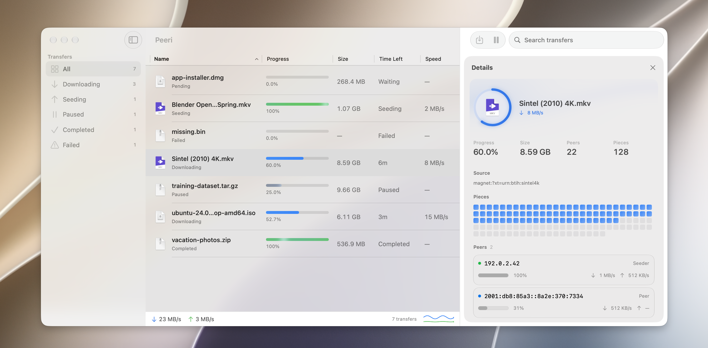

<p align="center">
  
</p>

<h1 align="center">Peeri</h1>

<p align="center">A native Mac app for torrents, downloads, and video.</p>

<p align="center">
  <a href="https://github.com/Aayush9029/Peeri/releases/latest">
    
  </a>
</p>

<p align="center">
  
  <br><sub>Interface shown with sample transfers.</sub>
</p>

## Why Peeri

Keep direct downloads, magnet links, torrent files, and supported video links in one place. Peeri bundles aria2, yt-dlp, and FFmpeg, with native Mac controls for pausing, resuming, seeding limits, peer discovery, trackers, and connection settings.

Press **⌘N** to add a download, **⌘K** to search commands or add links from your clipboard, or **⌘I** to inspect a transfer. Use the arrow keys in Add Download to choose a link, torrent file, or destination folder. A live peer network, speed charts, and a piece map show what is happening without filling the toolbar with controls.

## Install

Download the latest DMG, open it, and drag Peeri into Applications. Requires an Apple Silicon Mac running macOS 14.4 or later. Liquid Glass cards use macOS 26 or later; earlier systems use frosted materials.

Video downloads support YouTube and Vimeo links when the site makes a compatible format available. Torrent file-preview priority downloads the beginning and end first; it is not strict sequential torrent downloading. Tracker lists control announce servers, not peer IP addresses.

To build from source, open `Peeri.xcodeproj` in Xcode or run:

```sh
xcodebuild -project Peeri.xcodeproj -scheme Peeri -configuration Release -arch arm64 build
swift test --package-path PeerKit
```

Report security issues using [the security policy](.github/SECURITY.md).

Approximate peer countries are resolved locally using [DB-IP Country Lite](https://db-ip.com/db/lite.php) (September 2026), licensed under [CC BY 4.0](https://creativecommons.org/licenses/by/4.0/). Peer IP addresses are never sent to a geolocation service.

The bundled download engine is self-contained. Its source archives and build instructions are included with the [v1.1 release](https://github.com/Aayush9029/Peeri/releases/tag/v1.1).
